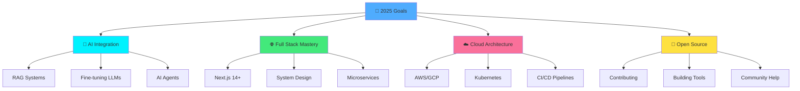

<div align="center">

<!-- Cinematic Opening -->


</div>

---

<br/>

<table width="100%">
<tr>
<td width="50%" valign="top">

## 📡 SIGNAL DETECTED

```bash
> Scanning developer profile...
> Identity: Kishore Balaji
> Origin: Coimbatore, India
> Level: 21 | CGPA: 8.05
> Class: Full Stack Developer & AI Mage
> Status: [ACTIVE] - Currently Shipping Code
> 
> SKILLS LOADING................. ▓▓▓▓▓▓▓▓▓▓ 100%
> CREATIVITY LOADING............ ▓▓▓▓▓▓▓▓▓▓ 100%
> COFFEE LEVELS................. ▓▓▓▓▓▓▓▓▓▓ MAX
> 
> CONNECTION ESTABLISHED ✓
```

### 🎯 MISSION STATEMENT

> *Building the bridge between human imagination and digital reality through code, AI, and endless cups of coffee.*

**Current Objective:** Creating AI-powered solutions that make people's lives easier, one line of code at a time.

</td>
<td width="50%" valign="top">

## 🌊 LIVE METRICS DASHBOARD

```javascript
const kishoreBalaji = {
  location: "Coimbatore, India 🇮🇳",
  education: "B.Tech AI @ Amrita University",
  languages: ["English", "Tamil", "JavaScript", "Python"],
  timezone: "IST (GMT+5:30)",
  availability: "Open for collaborations",
  
  workingOn: [
    "AI-Powered Web Applications",
    "Full Stack Projects",
    "Open Source Contributions"
  ],
  
  expertise: {
    frontend: ["React", "Next.js", "Modern UI/UX"],
    backend: ["Node.js", "Python", "FastAPI"],
    ai: ["LLMs", "ML Models", "Computer Vision"],
    database: ["PostgreSQL", "MongoDB", "Supabase"]
  }
};
```

<div align="center">


</div>

</td>
</tr>
</table>

---

## 🧬 DNA STRUCTURE → MY TECH STACK

<div align="center">

### The Double Helix of Development

<table>
<tr>
<td width="50%" align="center">

#### 🎨 FRONTEND STRAND


**The Art Layer**
- Pixel-perfect implementations
- Responsive & accessible designs
- Smooth animations & interactions
- Component-driven architecture

</td>
<td width="50%" align="center">

#### ⚙️ BACKEND STRAND


**The Logic Layer**
- Scalable API architectures
- Efficient data handling
- Secure authentication systems
- Performance optimization

</td>
</tr>
</table>

---

### 🧠 THE NUCLEUS → AI/ML CORE

<table>
<tr>
<td align="center">


</td>
<td align="center">


</td>
<td align="center">


</td>
</tr>
<tr>
<td colspan="3" align="center">

**Intelligence Integration**
```
Machine Learning ◆ Deep Learning ◆ LLM Applications ◆ Computer Vision ◆ Data Analysis
```

</td>
</tr>
</table>

---

### 🗄️ DATA STORAGE MATRIX

<table width="100%">
<tr>
<td width="25%" align="center">


**PostgreSQL**
Relational Power

</td>
<td width="25%" align="center">


**MongoDB**
NoSQL Flexibility

</td>
<td width="25%" align="center">


**Supabase**
Firebase Alternative

</td>
<td width="25%" align="center">


**Neo4j**
Graph Database

</td>
</tr>
</table>

---

### 🛠️ DEVOPS & TOOLS ARSENAL

<table width="100%">
<tr>
<td align="center">


</td>
</tr>
<tr>
<td align="center">

**Git** • **GitHub** • **VS Code** • **Vercel** • **Render**

</td>
</tr>
</table>

---

### 💎 PROGRAMMING LANGUAGES

<table width="100%">
<tr>
<td align="center">


</td>
</tr>
<tr>
<td align="center">

**Java** • **Python** • **C** • **C++** • **JavaScript**

</td>
</tr>
</table>

</div>

---

## 🎬 PROJECT SPOTLIGHT → WHAT I'VE BUILT

<div align="center">

### Featured Creations

</div>

<table>
<tr>
<td width="33%" valign="top">

### 🤖 AI Applications
```
┌─────────────────────┐
│  🎯 LLM Chatbots   │
│  👁️ Computer Vision │
│  📊 Data Analytics  │
│  🔮 ML Predictions  │
└─────────────────────┘
```
Intelligent systems that learn, adapt, and solve real-world problems.

</td>
<td width="33%" valign="top">

### 🌐 Web Platforms
```
┌─────────────────────┐
│  ⚛️ React SPAs      │
│  🚀 Next.js Apps    │
│  🎨 UI/UX Designs   │
│  📱 Responsive Sites│
└─────────────────────┘
```
Beautiful, fast, and user-friendly web experiences.

</td>
<td width="33%" valign="top">

### 🔧 Developer Tools
```
┌─────────────────────┐
│  🛠️ Automation      │
│  📦 npm Packages    │
│  🔌 APIs & SDKs     │
│  📚 Documentation   │
└─────────────────────┘
```
Tools that make developers' lives easier and more productive.

</td>
</tr>
</table>

---

## 🎯 CURRENT FOCUS AREAS

<div align="center">



</div>

---

## 🏆 ACHIEVEMENTS & CERTIFICATIONS

<table width="100%">
<tr>
<td width="50%">

### 📜 Official Certifications

```yaml
🎓 Education:
  - B.Tech in Artificial Intelligence
  - Amrita Vishwa Vidyapeetam
  - CGPA: 8.05/10.0
  - Expected: 2026

☁️ Cloud Certifications:
  - Oracle Cloud Infrastructure AI Foundations
  - Status: Certified ✓
  - Year: 2024
```

</td>
<td width="50%">

### 💪 Skills Unlocked

```python
achievements = {
    "coding_challenges": "100+ Problems Solved",
    "projects_built": "10+ Full Stack Apps",
    "ml_models": "Multiple Models Deployed",
    "apis_created": "RESTful & GraphQL APIs",
    "contributions": "Open Source Active",
    "coffee_consumed": "∞ Cups & Counting"
}
```

</td>
</tr>
</table>

---

## 📊 GITHUB ANALYTICS

<div align="center">


</div>

---

## 🎨 CODING PHILOSOPHY

<table width="100%">
<tr>
<td width="33%" align="center">

### 💭 MINDSET

```
┌──────────────┐
│ User First   │
│ Clean Code   │
│ Test Driven  │
│ Always Learn │
│ Ship Fast    │
└──────────────┘
```

</td>
<td width="33%" align="center">

### ⚡ WORKFLOW

```
┌──────────────┐
│ Plan → Code  │
│ Test → Debug │
│ Review → Fix │
│ Deploy → 🚀  │
│ Iterate ♻️   │
└──────────────┘
```

</td>
<td width="33%" align="center">

### 🎯 VALUES

```
┌──────────────┐
│ Quality > 📊 │
│ Impact > 🎯  │
│ Growth > 📈  │
│ Collab > 🤝  │
│ Passion > 💖 │
└──────────────┘
```

</td>
</tr>
</table>

<div align="center">

> *"Code is poetry written for machines but read by humans. Make it beautiful, make it meaningful, make it matter."*

</div>

---

## 🌈 THE HUMAN SIDE

<table width="100%">
<tr>
<td width="50%" valign="top">

### ☕ Daily Rituals

```javascript
const myDay = async () => {
  while (true) {
    await brewCoffee();
    await checkGitHub();
    await readTechNews();
    
    for (let i = 0; i < 6; i++) {
      await writeCode();
      await solveProblem();
    }
    
    await deployToProduction();
    await celebrateWin();
    
    if (time >= "11:00 PM") {
      console.log("Peak productivity hours 🌙");
    }
  }
};
```

</td>
<td width="50%" valign="top">

### 🎮 Outside of Code

```yaml
Interests:
  - 📚 Reading tech blogs & documentation
  - 🎵 Lo-fi music while coding
  - 🌙 Night owl programmer
  - 🧩 Solving algorithmic puzzles
  - 🤝 Mentoring fellow developers
  - 🌱 Learning something new daily

Personality:
  - Problem solver at heart
  - Detail-oriented perfectionist
  - Team player & collaborator
  - Continuous learner
  - Open source enthusiast
```

</td>
</tr>
</table>

---

## 🔗 CONNECT & COLLABORATE

<div align="center">

### Let's Build Something Amazing Together!

<table>
<tr>
<td align="center" width="20%">

<a href="https://kishore-balaji.vercel.app/">

</a>

**Visit My Website**

</td>
<td align="center" width="20%">

<a href="https://www.linkedin.com/in/kishore-balaji-081168292">

</a>

**Professional Network**

</td>
<td align="center" width="20%">

<a href="https://github.com/kishore-balaji">

</a>

**Code Repository**

</td>
<td align="center" width="20%">

<a href="https://www.instagram.com/kishore_balaji_03">

</a>

**Social Updates**

</td>
<td align="center" width="20%">

<a href="mailto:kishorebalajisivani@gmail.com">

</a>

**Direct Contact**

</td>
</tr>
</table>

### 🎯 Coding Platforms

<a href="https://leetcode.com/kishore_balaji_03">

</a>
<a href="#">

</a>
<a href="#">

</a>

<br/><br/>


</div>

---

## 🎪 FUN ZONE

<div align="center">

### 🎲 Developer Stats

```
╔════════════════════════════════════════╗
║  ☕ Coffee Consumed: ████████░░ 80%   ║
║  🌙 Night Coding: ██████████ 100%     ║
║  🐛 Bugs Fixed: ████████░░ 85%        ║
║  💡 Ideas Generated: ██████████ ∞     ║
║  🚀 Projects Deployed: ████████░ 90%  ║
║  😴 Sleep Schedule: ██░░░░░░░░ 20%    ║
╚════════════════════════════════════════╝
```

### 💡 Quick Facts

| ⏰ Best Coding Time | ☕ Fuel of Choice | 🎵 Coding Playlist | 🔧 Favorite IDE | 🌟 Code Style |
|:---:|:---:|:---:|:---:|:---:|
| 11 PM - 3 AM | Strong Black Coffee | Lo-fi Hip Hop | VS Code | Clean & Minimal |

</div>

---

<div align="center">

## 🎬 CLOSING SCENE

```
╔═══════════════════════════════════════════════════════════╗
║                                                           ║
║   "Every great developer you know got there by solving   ║
║    problems they were unqualified to solve until they    ║
║    actually did it."                                     ║
║                                                           ║
║   Building the future, one commit at a time.             ║
║   Let's create something extraordinary together! 🚀       ║
║                                                           ║
╚═══════════════════════════════════════════════════════════╝
```

### 🙏 Thank you for visiting!

**💬 Open for:** Collaborations • Freelance Projects • Open Source • Mentorship

---


---

<sub>⚡ This README updates automatically with my latest adventures in code</sub>


</div>
