<div align="center">

<!-- EPIC HEADER WITH GLITCH EFFECT -->
```
██╗  ██╗██╗███████╗██╗  ██╗ ██████╗ ██████╗ ███████╗    ██████╗  █████╗ ██╗      █████╗      ██╗██╗
██║ ██╔╝██║██╔════╝██║  ██║██╔═══██╗██╔══██╗██╔════╝    ██╔══██╗██╔══██╗██║     ██╔══██╗     ██║██║
█████╔╝ ██║███████╗███████║██║   ██║██████╔╝█████╗      ██████╔╝███████║██║     ███████║     ██║██║
██╔═██╗ ██║╚════██║██╔══██║██║   ██║██╔══██╗██╔══╝      ██╔══██╗██╔══██║██║     ██╔══██║██   ██║██║
██║  ██╗██║███████║██║  ██║╚██████╔╝██║  ██║███████╗    ██████╔╝██║  ██║███████╗██║  ██║╚█████╔╝██║
╚═╝  ╚═╝╚═╝╚══════╝╚═╝  ╚═╝ ╚═════╝ ╚═╝  ╚═╝╚══════╝    ╚═════╝ ╚═╝  ╚═╝╚══════╝╚═╝  ╚═╝ ╚════╝ ╚═╝
```

### 🌌 *Architect of Digital Dreams | AI Sorcerer | Code Poet* 🌌


<br/>

<!-- MATRIX-STYLE ANIMATION -->
```diff
> SYSTEM BOOT SEQUENCE INITIATED...
> LOADING CONSCIOUSNESS.EXE...
> NEURAL NETWORK: ████████████████████ [ONLINE]
> CREATIVITY ENGINE: ████████████████████ [MAXIMUM]
> COFFEE LEVELS: ████████████████████ [OPTIMAL]
> STATUS: ✅ READY TO BUILD THE IMPOSSIBLE
```

<!-- FANCY BADGES -->
<p align="center">
  
  
  
  
</p>

<p align="center">
  
  
  
</p>

---

</div>

## 🎭 WHO AM I? *[SELECT YOUR PERSPECTIVE]*

<table>
<tr>
<td width="50%">

### 👨‍💻 **THE PROFESSIONAL VERSION**

```python
class KishoreBalaji:
    def __init__(self):
        self.name = "Kishore Balaji"
        self.role = "Full Stack Developer & AI Engineer"
        self.location = "Coimbatore, India 🇮🇳"
        self.education = {
            "degree": "B.Tech in Artificial Intelligence",
            "university": "Amrita Vishwa Vidyapeetam",
            "cgpa": 8.05,
            "graduation": 2026
        }
        self.life_motto = "Build. Break. Learn. Repeat."
    
    def current_focus(self):
        return [
            "🤖 AI-Powered Web Applications",
            "🌐 Scalable Backend Systems",
            "🎨 Pixel-Perfect UX Design",
            "📚 Open Source Contributions"
        ]
    
    def get_superpower(self):
        return "Converting ☕ into </>"
```

</td>
<td width="50%">

### 🎮 **THE GAMER VERSION**

```yaml
╔═══════════ PLAYER PROFILE ═══════════╗
║                                      ║
║  IGN: Kishore Balaji                 ║
║  Class: Omni-Developer 🌟            ║
║  Level: 21                           ║
║  EXP: 8,050 / 10,000                 ║
║                                      ║
║  ⚔️  STR (Coding): ████████░░ 87%   ║
║  🧠 INT (Problem Solving): █████ 95% ║
║  ⚡ AGI (Learning Speed): ██████ 92% ║
║  🎯 DEX (Debugging): ████████░ 85%   ║
║  💖 VIT (Persistence): ████████ 90%  ║
║  🌟 LUK (Coffee Finds): ████████ ∞   ║
║                                      ║
║  🏆 Titles Earned:                   ║
║  → "Bug Terminator"                  ║
║  → "The Stack Overflow Sage"         ║
║  → "AI Whisperer"                    ║
║  → "Midnight Code Warrior"           ║
║                                      ║
╚══════════════════════════════════════╝
```

</td>
</tr>
</table>

<div align="center">

### 💭 *"In a world full of problems, I'm the algorithm that finds solutions"*

</div>

---

## 🛠️ THE ARSENAL *[WEAPONS OF CHOICE]*

<div align="center">

### 🎯 **SKILL TREE** → *Hover Over Each Branch*

</div>

<table>
<tr>
<td width="33%" align="center">

#### 🎨 **FRONTEND MASTERY**
```
      🌳
     /|\
    / | \
   /  |  \
  /   |   \
 /    |    \
🎨   ⚛️   🎯
```


**Crafting Beautiful UIs**
- React.js Ecosystem
- Next.js Power User
- Responsive Design Guru
- Animation Wizard
- Component Architecture

</td>
<td width="33%" align="center">

#### ⚙️ **BACKEND WIZARDRY**
```
      🏰
     /|\
    / | \
   /  |  \
  ⚡  🐍  ☕
```


**Building Robust Systems**
- RESTful API Design
- Database Optimization
- Authentication & Security
- Microservices
- Server Management

</td>
<td width="33%" align="center">

#### 🤖 **AI SORCERY**
```
      🧠
     /|\
    / | \
   🔮 🎯 ✨
```

<br/>


**Intelligent Solutions**
- Machine Learning Models
- LLM Integration
- Computer Vision
- NLP Applications
- Prompt Engineering

</td>
</tr>
</table>

<details>
<summary><b>🔍 Click to Expand Full Tech Stack</b></summary>
<br/>

<div align="center">

### **PROGRAMMING LANGUAGES**


### **FRAMEWORKS & LIBRARIES**


### **AI/ML TOOLS**


### **DATABASES**


### **TOOLS & PLATFORMS**


</div>

</details>

---

## 🎯 MISSION CONTROL *[WHAT I'M BUILDING]*

```mermaid
mindmap
  root((🚀 Kishore<br/>Balaji))
    🎨 Frontend
      React Apps
      Responsive Design
      User Experience
      Animations
    ⚙️ Backend
      APIs
      Databases
      Authentication
      Scalability
    🤖 AI/ML
      LLM Integration
      Computer Vision
      Chatbots
      Automation
    🌟 Projects
      AI Tools
      Web Apps
      Open Source
      Innovation
```

<div align="center">



</div>

### 🔥 **ACTIVE PROJECTS** → *Currently Brewing*

<table>
<tr>
<td width="50%">

#### 🚀 **HIGH PRIORITY MISSIONS**

```javascript
const activeProjects = {
  🎯 primary: [
    "AI-powered productivity tools",
    "Next.js full-stack applications",
    "RAG-based chatbot systems",
    "Open-source contributions"
  ],
  
  🧪 experimental: [
    "Real-time collaboration platforms",
    "Computer vision applications",
    "Blockchain integration",
    "Developer automation tools"
  ],
  
  💡 learning: [
    "System design patterns",
    "Cloud architecture (AWS/GCP)",
    "Advanced React patterns",
    "Microservices with Docker"
  ]
};
```

</td>
<td width="50%">

#### 🎓 **SKILL ACQUISITION ROADMAP**

```yaml
2024_Q4: ✅
  - Oracle Cloud AI Certification
  - Advanced React & Next.js
  - LLM Fine-tuning
  
2025_Q1: 🔄 IN PROGRESS
  - System Design Mastery
  - DevOps & CI/CD
  - Kubernetes Basics
  - AWS Solutions Architect
  
2025_Q2: 📋 PLANNED
  - Microservices Architecture
  - GraphQL Advanced
  - Mobile Development
  - Performance Optimization
```

</td>
</tr>
</table>

---

## 🏆 HALL OF FAME *[ACHIEVEMENTS UNLOCKED]*

<div align="center">

### 🎖️ **TROPHY CABINET**

</div>

| 🏅 Trophy | 📊 Level | 🎯 Rarity | 📝 Quest Completed |
|:---:|:---:|:---:|:---|
| 🯠**Code Samurai** | MAX |  | Solved 100+ LeetCode Problems |
| 🏗️ **Full Stack Architect** | 18/20 |  | Built 10+ Production Apps |
| 🤖 **AI Engineer** | 16/20 |  | Deployed ML Models in Production |
| ☁️ **Cloud Certified** | 19/20 |  | Oracle Cloud AI Foundations |
| 🌟 **Open Source Hero** | 12/20 |  | Contributed to Public Repos |
| ⚡ **Performance Wizard** | 15/20 |  | Optimized Apps by 300% |
| 🔧 **Tool Smith** | 14/20 |  | Created Developer Utilities |
| 🨠**Design Maven** | 17/20 |  | Pixel-Perfect UI Implementation |

<div align="center">

### 📈 **STATS & ANALYTICS**


</div>

---

## 💭 CODE PHILOSOPHY *[MY DEVELOPER MANIFESTO]*

<div align="center">

```typescript
interface DeveloperManifesto {
  principles: string[];
  approach: string;
  values: string[];
  goal: string;
}

const myManifesto: DeveloperManifesto = {
  principles: [
    "👤 User Experience > Everything Else",
    "🧹 Clean Code is a Love Letter to Future Self",
    "🧪 Test Often, Deploy Confidently",
    "📚 Learn Daily, Grow Exponentially",
    "🤝 Collaboration > Competition",
    "🚀 Ship Fast, Iterate Faster",
    "💡 Solve Problems, Not Just Write Code"
  ],
  
  approach: "Build with empathy, code with passion, debug with patience",
  
  values: [
    "Quality over Quantity",
    "Impact over Perfection",
    "Growth over Ego",
    "Innovation over Convention"
  ],
  
  goal: "Create technology that makes life better, one commit at a time"
};

// THE DEVELOPER'S OATH
console.log("I solemnly swear to:");
console.log("✅ Write code that my future self won't curse");
console.log("✅ Comment like I'm explaining to a rubber duck");
console.log("✅ Git commit with meaningful messages");
console.log("✅ Never deploy on Fridays (well, mostly...)");
console.log("✅ Keep learning until the machines take over");
```

</div>

---

## 🎪 THE FUN ZONE *[EASTER EGGS & PERSONALITY]*

<table>
<tr>
<td width="33%" align="center">

### ☕ **FUEL SOURCE**
```
     (  )   (   )  )
      ) (   )  (  (
      ( )  (    ) )
     ____       ____
    |    |     |    |
    |____|     |____|
     |  |       |  |
     |__|       |__|
    /    \     /    \
   /______\   /______\
```
**Coffee:** *The programmer's elixir*
- Type: Strong Black ⚫
- Consumption: 4-6 cups/day
- Effect: +200% productivity
- Side Effect: Talks to code

</td>
<td width="33%" align="center">

### 🌙 **OPTIMAL CODING HOURS**
```
    .     *    .    *    
      *      .   *      .
   .    ⭐   .     *   .
  *   .   *    .    *   
    .    *   🌙   .   *
  *   .    *   .    *  
   .    *    .   ⭐  .  
```
**Peak Performance:**
- 🕐 11 PM - 3 AM
- 🎧 Lo-fi Beats ON
- 💡 Night Owl Mode
- 🔥 God-Tier Focus
- 🌃 When bugs fear me

</td>
<td width="33%" align="center">

### 🎮 **DEVELOPER PERSONALITY**
```
  +------------------------+
  |  PERSONALITY TYPE:     |
  |  ■■■■■■■■■□ 90%        |
  |  Introvert             |
  |                        |
  |  ■■■■■■■■■■ 100%       |
  |  Problem Solver        |
  |                        |
  |  ■■■■■■■■■□ 95%        |
  |  Perfectionist         |
  |                        |
  |  ■■■■■■■■□□ 85%        |
  |  Team Player           |
  +------------------------+
```

</td>
</tr>
</table>

<div align="center">

### 🎯 **CURRENT STATUS**

```javascript
const currentStatus = {
  mood: "🔥 Absolutely Pumped",
  activity: "💻 Shipping Production Code",
  music: "🎵 Lo-fi Hip Hop Radio - Beats to Code To",
  coffee: "☕ Cup #4 (and counting...)",
  brain: "🧠 100% Focused",
  motivation: "📈 OVER 9000!",
  bugCount: "🐛 0 (for now...)",
  vibes: "✨ Immaculate",
  nextMilestone: "🏆 Launch Next Big Thing"
};

// LIVE STATUS
Object.entries(currentStatus).forEach(([key, value]) => {
  console.log(`${key}: ${value}`);
});
```

</div>

<details>
<summary><b>🎲 Click for Random Developer Wisdom</b></summary>
<br/>

<div align="center">

### 💡 **WISDOM SCROLLS**

> *"First, solve the problem. Then, write the code."* - John Johnson

> *"Code is like humor. When you have to explain it, it's bad."* - Cory House

> *"The best error message is the one that never shows up."* - Thomas Fuchs

> *"Talk is cheap. Show me the code."* - Linus Torvalds

> *"The only way to go fast, is to go well."* - Uncle Bob Martin

### 🎭 **DEVELOPER TRUTHS**

- ✅ Coffee is a programming language
- ✅ Debugging is twice as hard as writing code
- ✅ It works on my machine = Universal truth
- ✅ The best code is no code at all
- ✅ Documentation? I'll do it tomorrow (narrator: they didn't)
- ✅ stackoverflow.com = Developer's best friend
- ✅ Semicolons are optional (but are they really?)

</div>

</details>

---

## 🌐 CONNECT WITH ME *[JOIN THE NETWORK]*

<div align="center">

### 🚀 **LET'S BUILD SOMETHING AMAZING TOGETHER!**

<table>
<tr>
<td align="center" width="25%">

### 🌍 **Portfolio**
[](https://kishore-balaji.vercel.app/)

*Explore my work,*  
*projects, and journey*

</td>
<td align="center" width="25%">

### 💼 **LinkedIn**
[](https://www.linkedin.com/in/kishore-balaji-081168292)

*Let's connect*  
*professionally*

</td>
<td align="center" width="25%">

### 📸 **Instagram**
[](https://www.instagram.com/kishore_balaji_03)

*Life, coffee,*  
*& occasional bugs*

</td>
<td align="center" width="25%">

### 📧 **Email**
[](mailto:kishorebalajisivani@gmail.com)

*Got a project idea?*  
*Let's talk!*

</td>
</tr>
</table>

### 🎯 **CODING BATTLEGROUNDS**

<a href="https://leetcode.com/kishore_balaji_03">
  
</a>
<a href="https://github.com/kishore-balaji">
  
</a>
<a href="#">
  
</a>
<a href="#">
  
</a>

<br/><br/>

### 📊 **MY LEETCODE JOURNEY**


</div>

---

## 🎁 SPECIAL FEATURES *[INTERACTIVE ELEMENTS]*

<div align="center">

### 🎪 **VISITOR'S GUESTBOOK**

```
╔═══════════════════════════════════════════════════════╗
║                                                       ║
║   👋 You are visitor #[COUNTER] to this profile!     ║
║                                                       ║
║   📝 Leave a ⭐ if you like what you see!            ║
║   🤝 Let's collaborate on something awesome!          ║
║   💬 Feel free to reach out anytime!                  ║
║                                                       ║
║   🎯 Together, we can build the future! 🚀           ║
║                                                       ║
╚═══════════════════════════════════════════════════════╝
```

### 🎵 **NOW PLAYING** *[My Coding Playlist]*

```
♪ ♫ ♪ ♫ ♪ ♫ ♪ ♫ ♪ ♫ ♪ ♫ ♪ ♫ ♪ ♫

🎧 Lo-fi Hip Hop Radio - Beats to Code/Relax To
⏯️ ████████████████░░░░ 78%
🔊 ▁ ▂ ▃ ▅ ▆ ▇ █ ▇ ▆ ▅ ▃ ▂ ▁

♪ ♫ ♪ ♫ ♪ ♫ ♪ ♫ ♪ ♫ ♪ ♫ ♪ ♫ ♪ ♫
```

</div>

---

## 📜 THE CHRONICLES *[CLOSING THOUGHTS]*

<div align="center">

```
╔═══════════════════════════════════════════════════════════════╗
║                                                               ║
║  "In the digital realm where logic meets creativity,          ║
║   I craft solutions with code and build dreams with AI.       ║
║                                                               ║
║   Every bug is a lesson, every feature is a story,            ║
║   Every commit is a step towards something extraordinary."    ║
║                                                               ║
║                        - Kishore Balaji                       ║
║                          Code Poet & AI Sorcerer              ║
║                                                               ║
╚═══════════════════════════════════════════════════════════════╝
```

<br/>

### 🌟 **THANK YOU FOR VISITING!** 🌟

```javascript
// A MESSAGE FOR YOU
const thankYou = {
  message: "Thanks for stopping by! ✨",
  wishes: [
    "May your code compile on first try",
    "May your bugs be easy to fix",
    "May your coffee always be strong",
    "May your deploys be smooth",
    "May your ideas turn into reality"
  ],
  callToAction: "Let's build something legendary together! 🚀"
};

console.log(thankYou);
```

<br/>

### ⚡ **QUICK ACTIONS**

<table>
<tr>
<td align="center">

**🌟 STAR**  
this profile

</td>
<td align="center">

**🔄 FORK**  
my projects

</td>
<td align="center">

**👀 FOLLOW**  
for updates

</td>
<td align="center">

**💬 CONNECT**  
let's collaborate

</td>
</tr>
</table>

<br/>

---

### 🎮 **CONTRIBUTION SNAKE GAME**


---

<br/>

```diff
@@ SYSTEM STATUS @@
+ ✅ Profile Loaded Successfully
+ ✅ Skills Displayed
+ ✅ Projects Listed
+ ✅ Contact Information Available
+ ✅ Ready for Collaboration
! 
! 🚀 Deploying Dreams, One Commit at a Time
! 💻 Powered by Coffee, Built with Passion
! 
```

<br/>

### 📊 **LAST UPDATED:** `February 2025`


</div>

---

<div align="center">

**💖 Made with Love, Coffee, and Countless Hours of Debugging**

*🌟 If you've read this far, you're awesome! Let's connect! 🌟*

</div>
